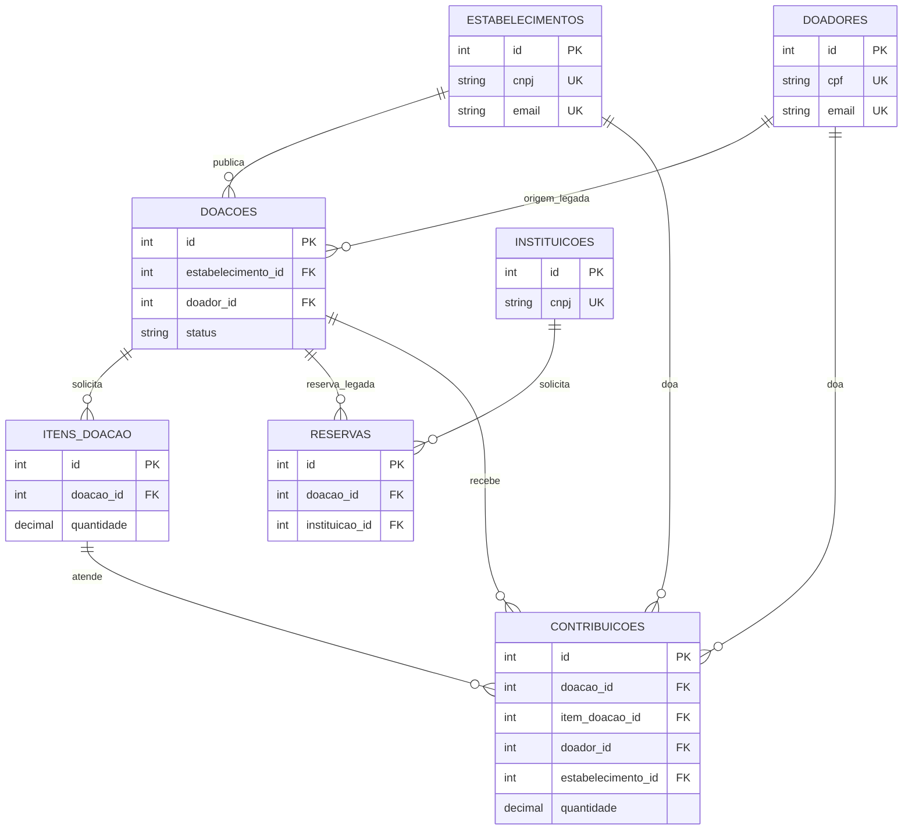

# Modelagem do banco — Checkpoint 2, critério 5

O modelo está em `models.py`; `schema.sql` descreve a instalação PostgreSQL. A aplicação aplica `migracoes.py` ao iniciar. Pedidos atuais são publicados por empresas em `doacoes` e detalhados em `itens_doacao`; pessoas e outras empresas entregam alimentos registrados em `contribuicoes`.

## Organização das entidades

| Tabela | Responsabilidade |
| --- | --- |
| `estabelecimentos` | Cadastro e credenciais das empresas, inclusive as que publicam pedidos. |
| `doadores` | Cadastro e credenciais de pessoas físicas. |
| `instituicoes` | Cadastro do fluxo legado de reservas. |
| `doacoes` | Cabeçalho do pedido, prazo, estado e origem. A origem por pessoa física e os dados de retirada persistem para os registros legados. |
| `itens_doacao` | Alimentos e quantidades solicitados por pedido; `validade` é opcional no pedido. |
| `contribuicoes` | Entrega oferecida para um item específico, com doador, quantidade, questionário, validade, estado e nome do arquivo da foto. |
| `reservas` | Vínculo legado entre uma instituição e uma doação. |

## Relacionamentos

Cada pedido tem uma origem, empresa ou pessoa, exigida por `ck_doacoes_uma_origem`. Um pedido pode ter vários itens, reservas e contribuições. Uma contribuição pertence a um pedido **e** a um item desse mesmo pedido: a chave estrangeira composta `(item_doacao_id, doacao_id) → itens_doacao(id, doacao_id)` garante esse vínculo mesmo fora da API. A chave única adicional `(id, doacao_id)` fornece o alvo exigido pela FK composta; `id` sozinho já identifica o item.

Cada contribuição tem exatamente um doador (`doador_id` ou `estabelecimento_id`), exigido por `ck_contribuicoes_uma_origem`. Cada reserva aponta para uma instituição e uma doação. As cardinalidades acima mostram que uma origem pode ter vários pedidos ou contribuições; cada linha filha aponta para no máximo um registro em cada papel.

As FKs de contribuições usam `ON DELETE RESTRICT`: uma entrega histórica impede remover seu pedido, item ou doador. Reservas também impedem remover a instituição ou a doação relacionada. A FK do pedido à empresa/pessoa restringe apagar a origem enquanto há pedido. Itens sem contribuição são removidos com o pedido (`ON DELETE CASCADE` no esquema novo e `delete-orphan` no ORM). O painel só permite remover pedidos sem contribuições nem reservas; a restrição no banco permanece como proteção para outros caminhos de escrita.

## Integridade dos dados

Todas as tabelas têm `id` como chave primária. As restrições principais do modelo novo e do `schema.sql` são:

| Tabela | NOT NULL, UNIQUE e FK | CHECK |
| --- | --- | --- |
| `estabelecimentos` | Nome, CNPJ, e-mail, telefone e endereço obrigatórios; CNPJ e e-mail únicos na tabela. | — |
| `doadores` | Nome, CPF, e-mail, telefone e `criado_em` obrigatórios; CPF e e-mail únicos na tabela. | — |
| `instituicoes` | Nome, CNPJ, e-mail, telefone e endereço obrigatórios; CNPJ e e-mail únicos na tabela. | — |
| `doacoes` | Prazo obrigatório; FKs opcionais para empresa e doador. | `ck_doacoes_uma_origem`: uma única origem; `ck_doacoes_status`: estado em `DISPONIVEL`, `RESERVADA`, `RETIRADA`. |
| `itens_doacao` | Pedido, nome, categoria, quantidade e unidade obrigatórios; FK para pedido; `uq_itens_doacao_id_doacao_id`. | `ck_itens_doacao_quantidade`: quantidade positiva. |
| `reservas` | Doação e instituição obrigatórias, ambas por FK. | `ck_reservas_status`: estado em `ATIVA`, `CANCELADA`, `CONCLUIDA`. |
| `contribuicoes` | Pedido, item, alimento, categoria, quantidade, unidade, validade, respostas, arquivo, estado e `criado_em` obrigatórios; FKs para pedido, item do mesmo pedido e origem. | `ck_contribuicoes_uma_origem`: um único doador; `ck_contribuicoes_quantidade`: quantidade positiva; `ck_contribuicoes_status`: estado em `ACEITA`, `ENTREGUE`, `CANCELADA`. |

Os estados de `doacoes` e `reservas` continuam anuláveis no esquema legado: o CHECK rejeita valores fora da lista, mas SQL permite `NULL` em CHECK; o código aplica o estado padrão nas criações normais. CNPJ válido, CPF válido, elegibilidade alimentar, prazo futuro, respostas do questionário, arquivo de imagem e limite de 6 MB são regras da API, pois dependem de formato, serviços externos, relógio ou arquivo. O cadastro e a edição de perfil verificam e-mail sem distinção de maiúsculas entre empresas e doadores; os CRUDs administrativos também verificam colisões antes de gravar. O banco garante unicidade apenas **dentro** de cada tabela. Para garantir unicidade global mesmo em escrita direta seria preciso uma tabela de identidades compartilhada ou gatilhos; essa mudança não foi feita em dados legados.

Em PostgreSQL existente, a migração cria a chave única e acrescenta CHECKs/FK composta ausentes com `NOT VALID`, depois executa `VALIDATE CONSTRAINT`. A segunda execução reconhece restrições já validadas. Se houver linha antiga incompatível, a validação falha com o nome da restrição e pede correção; a transação não apaga registros. O `schema.sql` cria as mesmas restrições para bancos novos. Em SQLite, tabelas **novas** via ORM já recebem os CHECKs e a FK composta. SQLite não aceita acrescentá-los a tabelas existentes por `ALTER TABLE`; a migração não recria todas as tabelas SQLite apenas por esta revisão para evitar riscos a referências e dados antigos. As recriações legadas de `doacoes` e `itens_doacao`, quando necessárias por outros motivos, incluem os CHECKs novos.

## Duplicidade de informações

Itens ficam em linhas de `itens_doacao`, sem colunas repetidas no pedido. O progresso (`recebido`, percentual e estado visual) é calculado pelas contribuições aceitas; não há contador persistido para sincronizar. `contribuicoes.alimento`, `categoria` e `unidade_medida` repetem atributos do item como **fotografia histórica** do alimento aceito. `foto_arquivo` guarda apenas o nome do arquivo privado, não uma segunda cópia da imagem no banco. A API atual ainda mostra alguns atributos do item referenciado; os campos históricos continuam disponíveis para auditoria.

`contribuicoes.doacao_id` repete o pedido alcançável por `item_doacao_id`. Ele permanece para consultas, painéis e integridade com registros existentes, agora protegido pela FK composta. `doacoes.doador_id` e `retirada_*` permanecem por causa do fluxo anterior em que pessoas publicavam excedentes e pelo CRUD original. Sua remoção exigiria verificar e migrar cada banco já instalado.

## Índices

PKs, CNPJ/CPF/e-mails únicos e a chave `(id, doacao_id)` já criam índices próprios. Os índices explícitos são:

| Índice | Consulta atendida |
| --- | --- |
| `ix_doacoes_estabelecimento_id` | Pedidos da empresa no painel e agregações por empresa. |
| `ix_doacoes_doador_id` | Doações legadas de uma pessoa no painel. |
| `ix_doacoes_status_prazo` | Pedidos abertos por estado e prazo na lista pública e no dashboard. |
| `ix_itens_doacao_doacao_id` | Itens de cada pedido no detalhe, painel e dashboard. |
| `ix_contribuicoes_doacao_status` | Contribuições aceitas por pedido e cálculo de progresso. |
| `ix_contribuicoes_item_doacao_id` | Contribuições por item no progresso. |
| `ix_contribuicoes_doador_id` | “Minhas doações” da pessoa. |
| `ix_contribuicoes_estabelecimento_id` | “Minhas doações” da empresa. |

`migracoes.py` cria os índices ausentes com `checkfirst=True`. A ordem das colunas compostas segue os filtros usados em `Publico.py`, `Painel.py` e `Dashboard.py`.

## Normalização

**1FN:** cada item e cada contribuição ocupa uma linha com atributos atômicos para consulta; os itens de um pedido não ficam em uma lista dentro de `doacoes`. `respostas` é JSON textual do questionário, mantido como registro da submissão, não como chave de relacionamento. **2FN:** as tabelas de negócio usam PK simples `id`; os atributos de cada linha dependem dela, não de parte da chave única auxiliar `(id, doacao_id)`. **3FN:** dados de empresa e doador ficam nos cadastros, e contagens derivadas não são gravadas no pedido. As descrições históricas do item em `contribuicoes` e o `doacao_id` redundante são exceções deliberadas, justificadas acima e controladas pela FK composta. Endereços legados ainda são texto livre; o filtro por UF depende do formato `cidade/UF` e uma decomposição exigiria migração própria.

Eventos (`data_cadastro`, `criado_em`, `data_reserva`) escritos pelo ORM usam UTC sem offset; `data_limite_retirada` representa hora civil de Brasília. A API serializa com o fuso explícito e o dashboard agrupa eventos no dia de `America/Sao_Paulo`.

## Decisões de modelagem

| Decisão | Alternativa considerada | Por que foi escolhida |
| --- | --- | --- |
| Cabeçalho `doacoes` e linhas `itens_doacao` | Colunas fixas para vários alimentos | Um pedido pode solicitar quantos itens forem necessários sem repetir grupos de colunas. |
| FK composta de contribuição para item e pedido | Conferência apenas em `Contribuicoes.py` | Escritas diretas também não podem vincular item de outro pedido. |
| Conservar `doacao_id` em contribuições | Derivar sempre pelo item | Preserva consultas e dados existentes; a FK composta elimina a inconsistência possível. |
| Conservar a descrição do item na contribuição | Ler sempre o item atual | Preserva o alimento declarado no momento da doação. |
| Manter origem e retirada legadas no pedido | Apagar colunas antigas | Evita perder excedentes históricos e mantém o CRUD original. |
| Unicidade de e-mail entre tipos na aplicação | Tabela única de identidades ou gatilhos | Evita uma migração de cadastros neste checkpoint; o limite para escrita direta está documentado. |
| Validar PostgreSQL com `NOT VALID` seguido de `VALIDATE` | Recriar tabelas | Acrescenta proteção sem copiar ou apagar registros; erros antigos são expostos antes de aceitar a migração. |
| Não reconstruir todas as tabelas SQLite antigas | Copiar tabelas para instalar novos CHECKs/FK | Preserva bancos legados sem alterar referências; instalações novas já recebem as restrições. |
