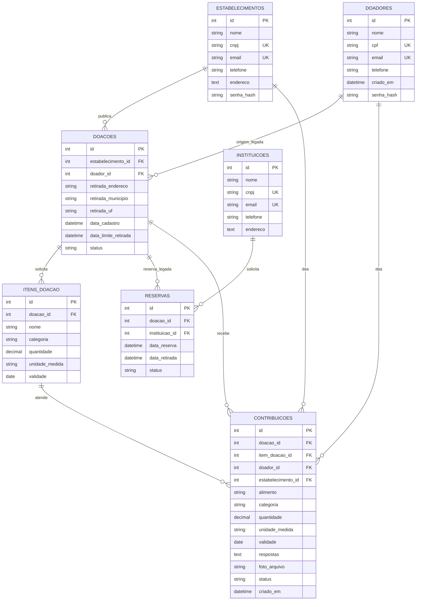

# Modelagem do banco — Checkpoint 2

## Entidades e relações

`PK` é chave primária; `FK`, chave estrangeira; `UK`, coluna única. `doacoes` exige exatamente uma origem (`estabelecimento_id` ou `doador_id`) pelo CHECK `ck_doacoes_uma_origem`. `contribuicoes` exige exatamente um doador (pessoa ou empresa), quantidade positiva e status em `ACEITA`, `ENTREGUE` ou `CANCELADA`. `itens_doacao` referencia o pedido; a validade é opcional no pedido e obrigatória na contribuição. O esquema SQL legado também valida status de doações e reservas e quantidade dos itens; essas validações ainda não estão todas expressas como CHECK no ORM, portanto uma instalação pelo ORM e uma pelo `schema.sql` podem diferir nesse ponto.

## Índices

Além das PKs e UNIQUEs, a migração CP2 cria `ix_doacoes_estabelecimento_id`, `ix_doacoes_doador_id`, `ix_doacoes_status_prazo`, `ix_itens_doacao_doacao_id`, `ix_contribuicoes_doacao_status`, `ix_contribuicoes_item_doacao_id`, `ix_contribuicoes_doador_id` e `ix_contribuicoes_estabelecimento_id`. Os índices compostos seguem os filtros das listas e agregações. A migração usa `create(checkfirst=True)` e pode rodar repetidamente em SQLite e PostgreSQL sem apagar dados.

## Decisões sobre colunas repetidas

`doacoes.doador_id` e `retirada_*` permanecem. Vieram do fluxo anterior em que pessoas físicas publicavam excedentes e podem guardar registros históricos; o CRUD original também continua acessível. Removê-las exigiria provar que estão vazias em cada banco e migrar os dados antigos, o que não é seguro inferir pelo código. O fluxo atual de pedidos usa `estabelecimento_id` e não preenche essas colunas.

`contribuicoes.alimento`, `categoria` e `unidade_medida` permanecem como fotografia do item no momento da contribuição. Se a descrição do pedido mudar depois, esses valores guardados preservam o que foi aceito. A referência `item_doacao_id` serve para calcular o progresso atual. A serialização atual ainda mostra campos do item referenciado; uma futura visualização de auditoria deve usar os campos históricos da contribuição.

As tabelas de cadastro e as relações de pedido/item separam entidades e grupos repetidos, atendendo à primeira forma normal; seus atributos dependem da chave inteira, atendendo à segunda. Os dados derivados de apresentação são calculados nas consultas, em vez de gravados no pedido. A fotografia imutável em `contribuicoes` é a exceção deliberada à terceira forma normal. Endereço ainda é texto livre nos cadastros legados; o filtro por UF depende do padrão `cidade/UF` e poderia evoluir para colunas próprias em migração futura.
